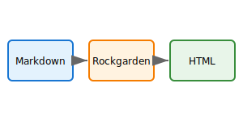

# Image Embeds

Obsidian uses `![[image.png]]` syntax to embed images.

## Basic Embed

![[attachments/logo.svg]]

## With Alt Text

![[attachments/diagram.svg|Build pipeline diagram]]

## With Width

![[attachments/logo.svg|50]]

## With Width and Height

![[attachments/icon.svg|48x48]]

## Standard Markdown Images

Standard markdown image syntax also works:

## Syntax Reference

| Syntax | Type | Result |
|--------|------|--------|
| `![[image.png]]` | Obsidian | Basic embed, filename as alt |
| `![[image.png\|description]]` | Obsidian | Custom alt text |
| `![[image.png\|100]]` | Obsidian | Width of 100px |
| `![[image.png\|100x200]]` | Obsidian | Width 100px, height 200px |
| `` | Markdown | Standard syntax |

## Back to Index

Return to [[index]].
